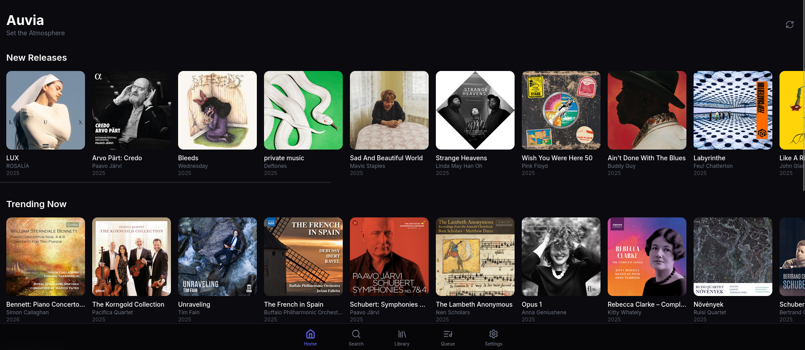
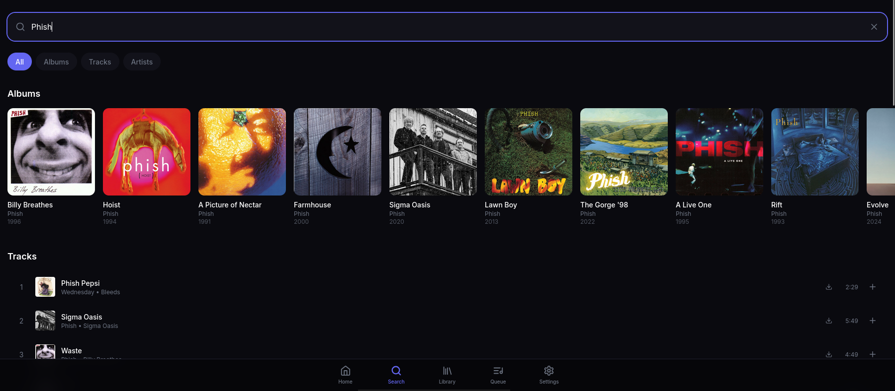
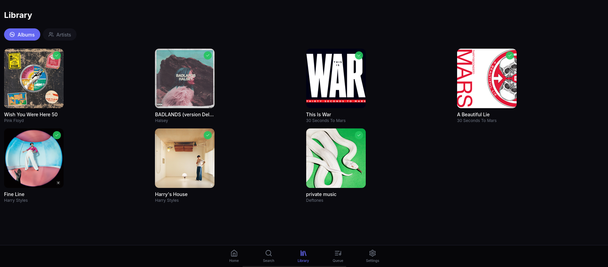
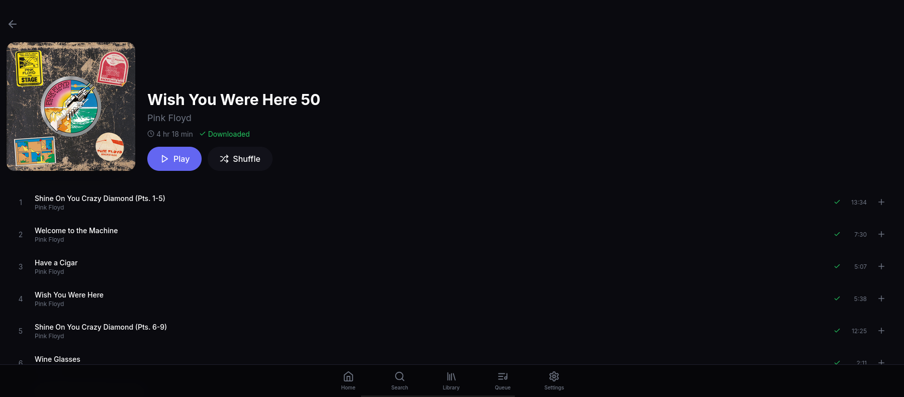
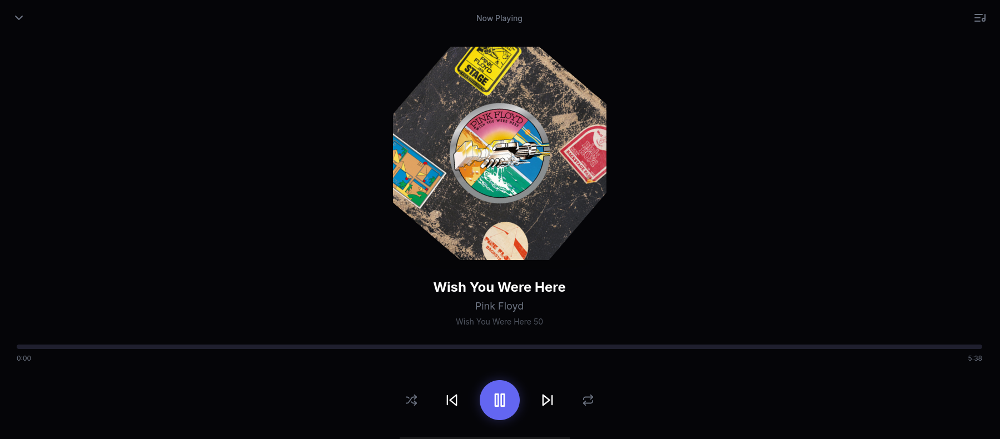
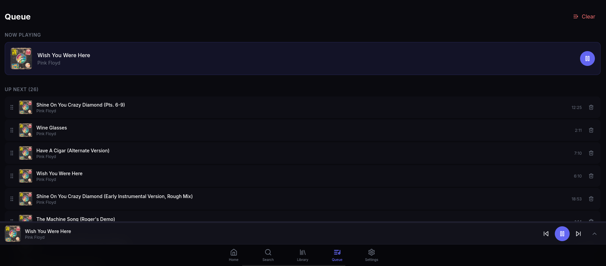

<div align="center">

# 🎵 Auvia

### *Set the Atmosphere*

A modern, self-hosted jukebox web application for high-quality music streaming.  
Think TouchTunes, but running on your own server with your Qobuz subscription.

[](https://www.docker.com/)
[](https://reactjs.org/)
[](https://fastapi.tiangolo.com/)
[](LICENSE)

[Features](#-features) • [Quick Start](#-quick-start) • [Screenshots](#-screenshots) • [Documentation](#-documentation) • [Contributing](#-contributing)

</div>

---

## ✨ Features

<table>
<tr>
<td width="50%">

### 🎨 Beautiful Interface
- **Mobile-first design** - Optimized for phones, tablets, and touch screens
- **Dark theme** - Sleek purple accent design perfect for any atmosphere
- **Responsive layout** - Works seamlessly on any screen size
- **Smooth animations** - Polished user experience with Framer Motion

</td>
<td width="50%">

### 🎵 Music Experience
- **Hi-Fi streaming** - Up to 24-bit/192kHz FLAC quality
- **Instant playback** - Downloaded music plays immediately
- **Smart queue** - Drag-and-drop reordering, history tracking
- **Gapless playback** - Seamless album listening experience

</td>
</tr>
<tr>
<td width="50%">

### 🔍 Discovery
- **Trending music** - Fresh content from Qobuz's trending charts
- **Instant search** - Real-time results as you type
- **Artist exploration** - Browse discographies and related artists
- **Local + Remote** - Unified search across your library and Qobuz

</td>
<td width="50%">

### 🛠️ Self-Hosted Power
- **On-demand downloads** - Music downloaded when you play it
- **Multi-storage support** - Use multiple drives for your library
- **Automatic scanning** - Library updates detect new files
- **Missing file detection** - Auto re-download if files go missing

</td>
</tr>
</table>

---

## 🚀 Quick Start

Get Auvia running in under 5 minutes:

### Prerequisites

- **Docker** and **Docker Compose** installed
- **Qobuz subscription** (for downloading music)
- **2GB+ RAM** recommended

### Installation

```bash
# Clone the repository
git clone https://github.com/neilyboy/Auvia.git
cd Auvia

# Copy environment file and configure
cp .env.example .env

# Start all services
docker compose up -d

# View logs (optional)
docker compose logs -f
```

### First-Time Setup

1. **Open the app** at `http://your-server-ip:3000`
2. **Go to Settings** (gear icon in bottom nav)
3. **Enter Qobuz credentials** (email and password)
4. **Start exploring!** Search for music or browse trending

> 📱 **Mobile Access**: Access from any device on your network using your server's IP address

---

## 📸 Screenshots

<div align="center">

| Home / Trending | Search | Library |
|:---:|:---:|:---:|
|  |  |  |

| Album View | Now Playing | Queue |
|:---:|:---:|:---:|
|  |  |  |

</div>

> 📷 *Screenshots show the dark theme interface with example content*

---

## 🏗️ Architecture

```
┌─────────────────────────────────────────────────────────────────┐
│                         Your Network                             │
├─────────────────────────────────────────────────────────────────┤
│                                                                  │
│   📱 Mobile Device ─────┐                                        │
│                         │                                        │
│   💻 Desktop Browser ───┼──▶  ┌─────────────────┐               │
│                         │     │    Frontend     │  Port 3000    │
│   🖥️ Any Browser ───────┘     │  React + Vite   │               │
│                               └────────┬────────┘               │
│                                        │                        │
│                                        ▼                        │
│                               ┌─────────────────┐               │
│                               │    Backend      │  Port 8001    │
│                               │    FastAPI      │               │
│                               └────────┬────────┘               │
│                                        │                        │
│                    ┌───────────────────┼───────────────────┐    │
│                    ▼                   ▼                   ▼    │
│           ┌──────────────┐    ┌──────────────┐    ┌───────────┐ │
│           │  PostgreSQL  │    │    Redis     │    │ Streamrip │ │
│           │   Database   │    │    Cache     │    │ Downloads │ │
│           └──────────────┘    └──────────────┘    └─────┬─────┘ │
│                                                         │       │
│                                                         ▼       │
│                                                  ┌────────────┐ │
│                                                  │   Qobuz    │ │
│                                                  │    API     │ │
│                                                  └────────────┘ │
│                                                                  │
│   📁 Music Storage: /music, /music2, /music3                    │
│                                                                  │
└─────────────────────────────────────────────────────────────────┘
```

---

## 📖 Documentation

| Document | Description |
|----------|-------------|
| 📘 [Installation Guide](docs/INSTALL.md) | Complete setup instructions for various platforms |
| ⚙️ [Configuration](docs/CONFIGURATION.md) | All settings and environment variables explained |
| 🔧 [Troubleshooting](docs/TROUBLESHOOTING.md) | Common issues and solutions |
| 🔌 [API Reference](docs/API.md) | Backend API documentation |

---

## 🛠️ Tech Stack

<table>
<tr>
<td align="center" width="20%">

**Frontend**


</td>
<td align="center" width="20%">

**Backend**


</td>
<td align="center" width="20%">

**Database**


</td>
<td align="center" width="20%">

**Infrastructure**


</td>
<td align="center" width="20%">

**Audio**


</td>
</tr>
</table>

---

## 📁 Project Structure

```
Auvia/
├── 📁 backend/                 # FastAPI backend application
│   ├── 📁 app/
│   │   ├── 📁 models/          # SQLAlchemy database models
│   │   ├── 📁 routers/         # API route handlers
│   │   ├── 📁 schemas/         # Pydantic request/response schemas
│   │   ├── 📁 services/        # Business logic (Qobuz, Streamrip, etc.)
│   │   ├── 📄 main.py          # FastAPI application entry
│   │   ├── 📄 config.py        # Configuration settings
│   │   └── 📄 database.py      # Database connection
│   ├── 📄 Dockerfile
│   └── 📄 requirements.txt
│
├── 📁 frontend/                # React frontend application
│   ├── 📁 src/
│   │   ├── 📁 components/      # Reusable UI components
│   │   ├── 📁 pages/           # Page components (Home, Search, etc.)
│   │   ├── 📁 stores/          # Zustand state management
│   │   ├── 📁 services/        # API client
│   │   └── 📄 App.jsx          # Main application component
│   ├── 📄 Dockerfile
│   └── 📄 package.json
│
├── 📁 docs/                    # Documentation
│   ├── 📁 screenshots/         # Application screenshots
│   ├── 📄 INSTALL.md
│   ├── 📄 CONFIGURATION.md
│   └── 📄 TROUBLESHOOTING.md
│
├── 📄 docker-compose.yml       # Docker Compose configuration
├── 📄 .env.example             # Example environment variables
├── 📄 README.md                # This file
└── 📄 LICENSE                  # MIT License
```

---

## 🔧 Configuration

### Environment Variables

Create a `.env` file from the example:

```bash
cp .env.example .env
```

Key settings:

| Variable | Description | Default |
|----------|-------------|---------|
| `POSTGRES_PASSWORD` | Database password | `auvia_secret` |
| `SECRET_KEY` | JWT signing key | *generate a secure key* |
| `MUSIC_PATH_1` | Primary music storage | `/home/user/music` |
| `MUSIC_PATH_2` | Secondary storage (optional) | - |
| `MUSIC_PATH_3` | Tertiary storage (optional) | - |

See [Configuration Guide](docs/CONFIGURATION.md) for all options.

---

## 🤝 Contributing

Contributions are welcome! Please read our [Contributing Guide](CONTRIBUTING.md) for details.

1. Fork the repository
2. Create a feature branch (`git checkout -b feature/amazing-feature`)
3. Commit your changes (`git commit -m 'Add amazing feature'`)
4. Push to the branch (`git push origin feature/amazing-feature`)
5. Open a Pull Request

---

## 📄 License

This project is licensed under the MIT License - see the [LICENSE](LICENSE) file for details.

---

## 🙏 Acknowledgments

- [Streamrip](https://github.com/nathom/streamrip) - Music downloading backend
- [Qobuz](https://www.qobuz.com/) - High-quality music streaming service
- [Howler.js](https://howlerjs.com/) - Audio playback library
- [Lucide](https://lucide.dev/) - Beautiful icon library

---

<div align="center">

**[⬆ Back to Top](#-auvia)**

Made with ❤️ for music lovers

</div>
